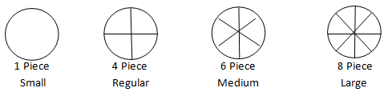
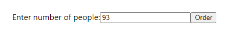
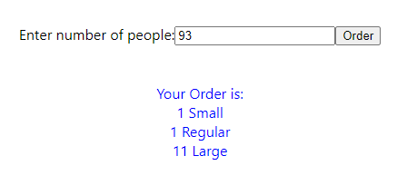

# Pizza Puzzle

## Details of Task

The Pizza Restaurant has 4 types of pizza as shown in the picture below

1. Small Size Pizza which has 1 piece
2. Regular Size Pizza which has 4 piece
3. Medium Size Pizza which has 6 piece
4. Large Size Pizza which has 8 piece

</img>

This Restaurant wants to deliver each piece of pizza to each person.

## Example

If restaurant takes order for 93 people,
then it has to make 
1. 1 Small Pizza
2. 1 Regular Pizza
3. 11 Large Pizza

### Input

</img>

### Output

</img>